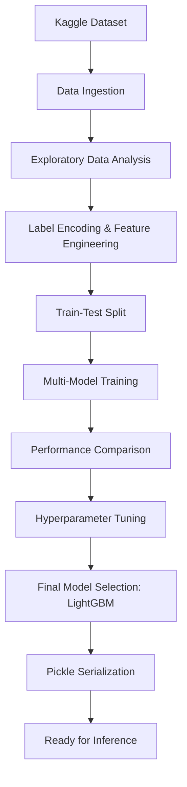

# 🏦 Loan Approval Predictor

[](https://www.python.org/)
[](https://scikit-learn.org/)
[](https://opensource.org/licenses/MIT)

### *Predicting Loan Eligibility with Industrial-Grade Machine Learning Pipelines*

---

## 🚀 The Elevator Pitch

Financial institutions face massive challenges in processing loan applications efficiently while minimizing credit risk. The **Loan Approval Predictor** is a comprehensive data science project that leverages state-of-the-art machine learning algorithms (XGBoost, LightGBM, Random Forest) to automate the prediction of loan approval status. By analyzing applicant profiles—from CIBIL scores to asset values—the model identifies high-potential candidates with over **90%+ accuracy** (depending on the model and tuning).

## ✨ Key Features

- **Multi-Model Orchestration:** Compares Logistic Regression, Random Forest, Gradient Boosting, XGBoost, and LightGBM.
- **Automated Hyperparameter Tuning:** Uses `RandomizedSearchCV` to extract peak performance from models.
- **Advanced EDA:** Deep-dive visualizations of feature correlations, including income vs. loan amount and CIBIL score distributions.
- **Modular Pipeline:** Clean, reproducible code from data ingestion to model serialization.
- **Production-Ready Serialization:** Implementation of model saving/loading using `pickle`.

## 🛠 Tech Stack

| Category | Technologies |
| :--- | :--- |
| **Languages** | Python |
| **Data Processing** | Pandas, NumPy |
| **Visualization** | Matplotlib, Seaborn |
| **Machine Learning** | Scikit-Learn, XGBoost, LightGBM |
| **Environment** | Jupyter Notebook, Google Colab |

## 📊 Performance Metrics

The project evaluates five distinct algorithms to ensure the highest predictive reliability. Below is a comparison of their baseline and optimized performance.

### Baseline Model Comparison
| Model | Accuracy (Baseline) | Training Time |
| :--- | :--- | :--- |
| **LightGBM** | **98.24%** | 0.1425s |
| XGBoost | 98.13% | 0.2920s |
| Gradient Boosting | 97.78% | 0.6062s |
| Random Forest | 97.66% | 0.4171s |
| Logistic Regression | 62.88% | 0.0375s |

### Hyperparameter Optimization (RandomizedSearchCV)
After extensive tuning, **LightGBM** emerged as the champion, balancing peak accuracy with unmatched computational efficiency.

| Model | Optimized Accuracy | Tuning Time | Key Parameters |
| :--- | :--- | :--- | :--- |
| **LightGBM** | **98.48%** | ~8s | `num_leaves: 25`, `max_depth: 10`, `lr: 0.1` |
| Gradient Boosting | 98.45% | ~782s | `n_estimators: 305`, `max_depth: 7` |
| XGBoost | 98.36% | ~220s | `n_estimators: 600`, `max_depth: 10` |
| Random Forest | 97.72% | ~21s | `n_estimators: 300`, `max_depth: 30` |

> [!TIP]
> **LightGBM** achieved the highest accuracy while being **97x faster** to tune than Gradient Boosting, making it the ideal choice for production-scale loan approval systems.

## 📐 Architecture

The following diagram illustrates the data flow and model development lifecycle:



## 🏁 Getting Started

### Prerequisites

- Python 3.8 or higher
- `pip` (Python package manager)

### Installation

1. **Clone the Repository:**
   ```bash
   git clone https://github.com/SukeshShetty1010/Loan-Approval-Predictor.git
   cd Loan-Approval-Predictor
   ```

2. **Install Dependencies:**
   ```bash
   pip install -r requirements.txt
   ```

## 💡 Usage

To explore the model development process, launch the Jupyter notebook:

```bash
jupyter notebook Loan_Approval_Prediction.ipynb
```

The notebook is divided into clear sections:
1. **EDA & Visualization:** Understand the "why" behind loan approvals.
2. **Model Training:** Watch as multiple SOTA models are compared.
3. **Inference:** Load the `pickle` file and predict for a new applicant profile.

## 📂 Project Structure

```text
.
├── Loan_Approval_Prediction.ipynb  # Main ML Pipeline
├── requirements.txt                 # Project Dependencies
└── README.md                        # Documentation
```

## 🗺 Roadmap

- [ ] **Deployment:** Build a FastAPI/Flask wrapper for real-time predictions.
- [ ] **Web UI:** Create a Streamlit dashboard for non-technical users to input applicant data.
- [ ] **Dockerization:** Containerize the application for seamless deployment.
- [ ] **Explainability:** Integrate SHAP or LIME to explain model decisions.

## 📝 License & Contact

Distributed under the MIT License. See `LICENSE` for more information (if applicable).

**Sukesh Shetty** - [GitHub](https://github.com/SukeshShetty1010)

Project Link: [https://github.com/SukeshShetty1010/Loan-Approval-Predictor](https://github.com/SukeshShetty1010/Loan-Approval-Predictor)
